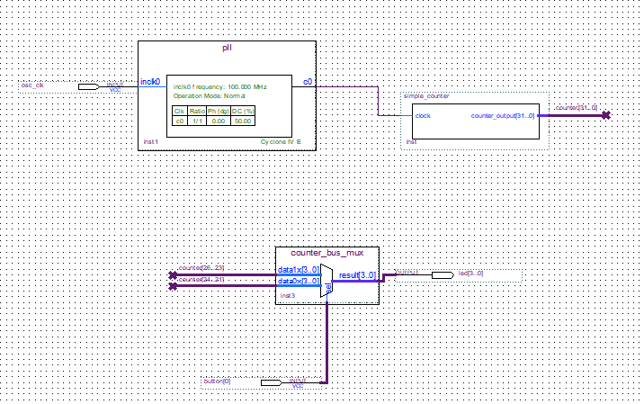

# 💡 Blinky

In this project we create a design that causes LEDs on the development board to blink at a speed that is controlled by an input button. 
## Implementation

  For the LED design, we will write Verilog HDL code for a simple 32-bit counter, add a phase-locked loop (PLL) megafunction as the clock source, and add a 2-input multiplexer megafunction. When the design is running on the board, we can press an input switch to multiplex the counter bits that drive the output LEDs.
  
  
### Dependencies
---
This project needs Quartus II.

### Building on Windows 10

 1. Download Quartus II from [here](https://www.intel.com/content/www/us/en/programmable/downloads/software/quartus-ii-we/121.html). See [Download and Installation Tutorial for Altera Quartus II Web Edition](https://www.youtube.com/watch?v=0Qza7wtBDKM).

  2. Clone the repository.
  3. Compile the design in Quartus II.
  4. That's all !

### Block diagram

### TODOs
---
 - ⭕ Create a basic Synopsys Design Constraints
 - ⭕ Verify in Hardware

